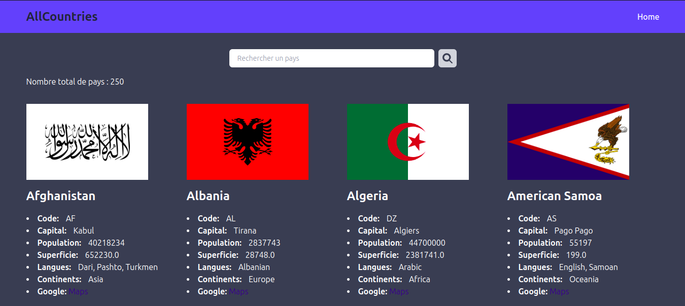
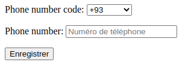

# ALL Countries
### Liste des pays avec leurs drapeaux, codes,capital, indicatifs téléphoniques,population,superficie,langues,continents et googleMaps

## data

```json
[
  {
        "name": "Senegal",
        "flag": "https://flagcdn.com/w320/sn.png",
        "code": "SN",
        "capital": "Dakar",
        "dial_code": "+221",
        "population": 18032473,
        "superficie": 196722.0,
        "independent": true,
        "languages": "French",
        "continents": "Africa",
        "googleMaps": "https://goo.gl/maps/o5f1uD5nyihCL3HCA"
    },
    {
        "name": "Serbia",
        "flag": "https://flagcdn.com/w320/rs.png",
        "code": "RS",
        "capital": "Belgrade",
        "dial_code": "+381",
        "population": 6908224,
        "superficie": 88361.0,
        "independent": true,
        "languages": "Serbian",
        "continents": "Europe",
        "googleMaps": "https://goo.gl/maps/2Aqof7aV2Naq8YEK8"
    },
]
```

##  exemple avec le demo django 


## Utulisation des dialcodes pour les numeros
Consulter le code source pour l'utulisation
### vue


## Installation

1. Cloner ce repository
2. Crée un environnement viruel et activer le
3. Installer les dépendances avec `pip install -r requirements.txt`
4. Exécuter l'application avec `python manage.py runserver`
5. Accéder à l'application sur votre navigateur en visitant `http://localhost:8000`

## Technologies utilisées

- Python
- Django
- Tailwind CSS
